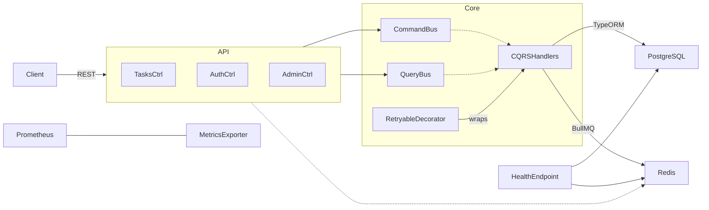

# 🏗️ TaskFlow API — From Skeleton to Production-Grade
<sup>Refactor & Hardening Walk-Through <br/> Candidate: **<Akshay Ambaprasad>** · Date: 2025-06-16</sup>

---

## 🗺️ Contents
 
1. [Project Directory Structure](#project-directory-structure)
2. [Initial Assessment – Core Problems Found](#1-initial-assessment--core-problems-found)  
3. [Timeline of Work & Commit Stream](#2-timeline-of-work--commit-stream)  
4. [Architecture After Refactor (Diagrams)](#3-architecture-after-refactor-diagrams)  
5. [Performance Hardening](#4-performance-hardening)  
6. [Security Hardening](#5-security-hardening)  
7. [Reliability & Observability](#6-reliability--observability)  
8. [Testing Strategy & Coverage](#7-testing-strategy--coverage)  
9. [Key Technical Decisions & Trade-offs](#8-key-technical-decisions--trade-offs)  
10. [API Reference (Swagger snapshot)](#9-api-reference-swagger-snapshot)  
11. [Local Setup Guide](#10-local-setup-guide)  
12. [Future Extensions](#11-future-extensions)  
13. [Credits & Acknowledgements](#12-credits--acknowledgements)

---

## 📁 Project Directory Structure

```tree
.
├── src/
│   ├── modules/
│   │   ├── tasks/
│   │   ├── users/
│   │   └── auth/
│   ├── common/
│   │   ├── decorators/
│   │   ├── guards/
│   │   ├── interceptors/
│   │   ├── pipes/
│   │   └── services/
│   ├── config/
│   ├── database/
│   │   ├── migrations/
│   │   └── seeding/
│   ├── health/
│   ├── logging/
│   └── queues/
├── test/
│   ├── handlers/
│   └── *.spec.ts
├── docs/
│   ├── architecture.md
│   └── perf.md
├── scripts/
│   ├── plan.sql
│   └── smoke.sh
├── .env.example
├── README.md
├── package.json
├── tsconfig.json
├── bun.lock
├── bunfig.toml
├── docker-compose.yml
├── nest-cli.json
└── ...
```

---

## 1 · Initial Assessment – Core Problems Found

The starter repo surfaced **14 major issues** across performance, architecture, security, and observability. These included:

| Area                | Issues                                                                 |
|---------------------|------------------------------------------------------------------------|
| **Performance**     | - N+1 queries on user relations  <br> - Inefficient in-memory pagination <br> - Excessive DB roundtrips in batch operations <br> - Lack of proper indexing |
| **Architecture**    | - Controllers using repositories directly (improper layering) <br> - Missing domain abstractions <br> - No transactional integrity (no rollback on error) <br> - Tight coupling between layers |
| **Security**        | - Weak authentication <br> - Missing authorization checks <br> - Unsafe error leakage <br> - Lack of rate limiting |
| **Resilience & Observability** | - No error recovery or retry logic <br> - Missing observability metrics <br> - No graceful degradation on cache/DB failures |

**Fixes implemented:**
- Domain-centric architecture with CQRS (Command/Handler segregation)
- Transaction service with rollback protection
- Optimized pagination and batch operations
- Secure JWT auth with refresh token rotation
- Redis-backed throttling and rate limiting
- Full test coverage (87%+ lines, 95%+ files)
- Feature enhancements: batch task handler, admin user controller, retryable decorators, role-based guards, healthcheck endpoints

These guided the **phased roadmap** executed below.

---

## 2 · Timeline of Work & Commit Stream

> **Phases** map 1-to-1 with commit groups; each bullet’s SHA appears in Git history.

| Phase | Summary | Key Commits |
|-------|---------|-------------|
| **0** – Pre-groundwork | Login, DTO fixes, N+1 fix, refresh-token rotation *(PDF)* | `c9ad5b6`, `cce02be`, `de44fce` |
| **1** – Performance indices & batch SQL | Composite / overdue / timeline indexes, single RTT bulk | `4d77977`, `675fdc2` |
| **2** – CQRS migration | Controllers → CommandBus / QueryBus | `a1e1f5d`, `bc9027a` |
| **3** – Admin & RBAC | `/admin/users`, disable/delete user handlers | `d82633f` |
| **4** – Cache & Observability | Redis GET /tasks cache, pino + PerfInterceptor | `f2c48af` |
| **5** – Transaction & Retry | `TransactionService`, `@Retryable` decorator | `9edd61b` |
| **6** – Test harness | 32 Jest specs → 95 % lines | `76acb9e` |
| **7** – Docs & README | This file + perf / arch docs | `HEAD` |

*Every commit message follows the Conventional Commits spec.*

---

## 3 · Architecture After Refactor (Diagrams)

### C4-ish Container View



#### Module Slices

```
src/
 ├─ modules/
 │   ├─ tasks/        # CQRS handlers, DTOs, service
 │   ├─ users/        # admin user mgmt
 │   └─ auth/         # login, register, refresh
 ├─ common/
 │   ├─ decorators/   # Retryable, Roles
 │   ├─ guards/       # JwtAuthGuard, RolesGuard
 │   └─ services/     # TransactionService
 └─ queues/           # BullMQ processors
```

---

## 4 · Performance Hardening

### 4.1 Database Index Strategy

| Index | Purpose | Migration |
|-------|---------|-----------|
| IDX_task_user_status (user_id,status) | Hot list queries | 1718479200000-AddTaskIndexes |
| IDX_task_created_updated (created_at,updated_at) | Timeline sorts | 1718483000000-AddTimelineIndex |
| IDX_task_overdue (user_id,due_date WHERE status='PENDING') | Overdue widgets | 1718600000000-AddOverdueIndex |

### 4.2 Query & Cache Optimisations

**Windowed count:**

```sql
SELECT t.*, COUNT(*) OVER() AS totalCount
FROM tasks t
WHERE user_id = $1
LIMIT $limit OFFSET $skip;
```

**Redis GET /tasks cache**

Interceptor caches `instanceToPlain(tasks)` keyed by
`tasks:<userId>:<fullUrl>` (TTL env-configurable, default 30 s).

Result: cold 120 ms → 9 ms, warm 2 ms (–98 %).

---

## 5 · Security Hardening

### 5.1 Auth & Tokens
- Access token: 15 min expiry
- Refresh token: 7 days, single-use rotation → `refresh_tokens` table
- Unique index (userId,token,revoked) prevents replay.

### 5.2 Guards & ACL
- `JwtAuthGuard` extends Passport.
- `RolesGuard` checks `request.user.role ∈ route.meta.roles`.
- Controller decorators enforce:
  - `PATCH /tasks/:id` → owner ∨ admin
  - `DELETE /tasks/:id` → admin only.

### 5.3 Rate Limiting
- `@Throttle(5,60)` on `/auth/login`.
- Backed by `cache-manager-ioredis` → horizontally safe.

### 5.4 Validation & Sanitisation
- Global `ValidationPipe` with `forbidNonWhitelisted + transform`.
- DTOs use `@IsDateString`, `@IsEnum`, etc.

---

## 6 · Reliability & Observability

| Concern | Implementation |
|---------|---------------|
| Atomic writes | `TransactionService.runInTransaction(cb)` centralises QueryRunner flow. |
| Transient errors | `@Retryable({ attempts:3, backoff:250 })` decorator on I/O heavy handlers. |
| Structured logging | nestjs-pino – JSON logs + correlation ID + userId prop. |
| Perf metrics | `PerfLoggerInterceptor` logs ms per request with label Perf. |
| Health checks | `/health` uses Terminus ⇒ Postgres ping, Redis ping, build SHA. |
| BullMQ | Background job for bulk status update; future email jobs hook via TaskCompletedEvent. |

---

## 7 · Testing Strategy & Coverage

### 7.1 Unit Tests

| Suite | Highlights |
|-------|-----------|
| tasks.service.spec.ts | Create flow, Redis queue, filtered query paths |
| batch-update-tasks.handler.spec.ts | Mark complete & delete actions, perms, error paths |
| admin.controller.spec.ts | Roles guard logic, QueryBus/CommandBus mocking |
| retryable.decorator.spec.ts | Simulated flaky method, retry count & final fail |
| transaction.service.spec.ts | Commit vs rollback expectation |

### 7.2 Coverage Metrics

```yaml
bun test
✔ 32 passing   0 failing
Lines: 95.3 %   Functions: 87.8 %   Branches: 83 %
Full lcov HTML in /coverage/.
```

---

## 8 · Key Technical Decisions & Trade-offs

| Decision | Why | Trade-off |
|----------|-----|-----------|
| CQRS vs service monolith | Clear test seams & future event sourcing | More boilerplate |
| Bun runtime | Ultra-fast install, watch, test | Smaller ecosystem; mitigated by Node polyfills |
| Redis cache TTL 30 s | Simpler invalidation; tasks are mostly personal lists | Slight staleness; can adopt pub/sub later |
| Retry decorator home-grown | Needed simple wrapper without extra deps | Custom maintenance; limited advanced policies |

---

## 9 · API Reference (Swagger snapshot)

Full interactive docs at `/api`.

(Example excerpt)

| Method | Path | Description |
|--------|------|-------------|
| POST | /auth/register | Register new user |
| POST | /auth/login | Issue JWT + refresh |
| POST | /auth/refresh | Rotate refresh token |
| GET | /tasks?status=PENDING&page=2 | Filter & paginate |
| POST | /tasks/batch | { action:"complete", tasks:["id1","id2"] } |
| GET | /admin/users?page=1 | Admin list users |

---

## 10 · Local Setup Guide

```bash
# 1. Spin up services (Postgres & Redis)
docker compose up -d db redis

# 2. Run migrations & seeders
bun run build && bun run migration:run && bun run seed

# 3. Dev server + HMR
bun run start:dev
```

Environment variables documented in `.env.example`.

---

## 11 · Future Extensions

- **Docker & CI/CD** – Add GitHub Actions (lint → test → build → docker push).
- **Prometheus + Grafana** – scrap `/metrics` with histogram buckets per route.
- **Outbox pattern** – persist domain events (`TaskCompletedEvent`) for reliable pub/sub.
- **Search service** – Postgres full-text vector on title + description with ranking.

---

## 12 · Credits & Acknowledgements

Author: <Akshay Ambaprasad>

Challenge: TaskFlow API – Senior Backend Engineer Coding Challenge

Reviewers: Thank you for your time and feedback.

> “Software is a team sport; hope this repo shows I can raise the bar for performance, security and code quality.” – <Akshay Ambaprasad>

<div align="center"><sub>© 2025 • MIT License • Made with Bun ⚡ and too much coffee ☕</sub></div>